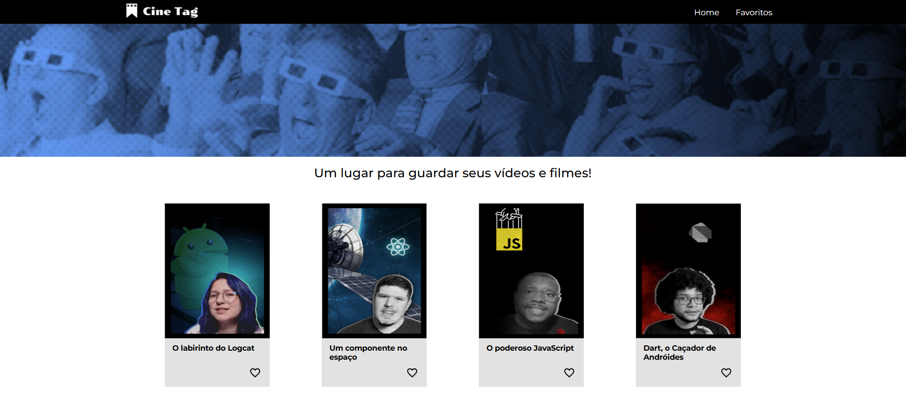
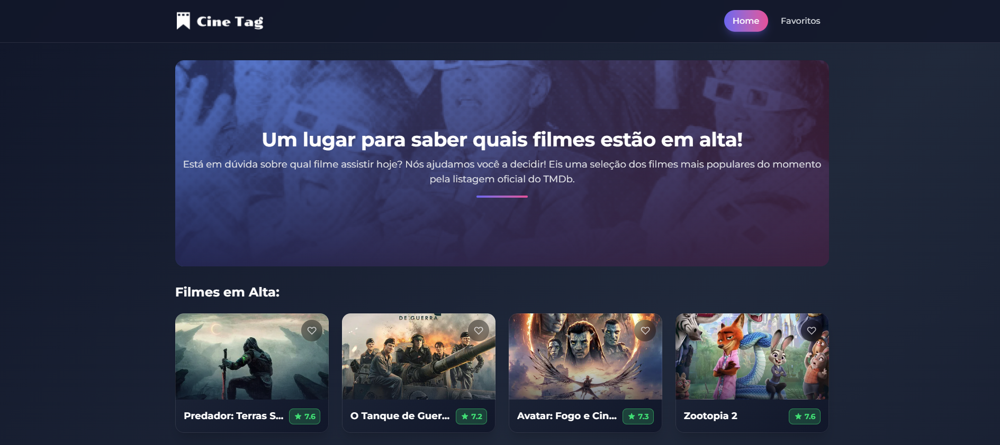

# 🎬 Cinetag - Descobra os Filmes em Alta

Uma aplicação web moderna para descobrir, explorar e favoritizar filmes populares com integração de inteligência artificial para críticas personalizadas.

[acesse o site](https://cinetag-teal.vercel.app/) 

## 📋 Sobre o Projeto

**Cinetag** é uma plataforma que ajuda você a decidir qual filme assistir consultando os filmes mais populares do momento. O app exibe:

- 🤖 Críticas geradas por IA (Google Gemini) para cada filme
- 📺 Catálogo dos filmes mais populares em tempo real
- ⭐ Avaliações coloridas 
- 📅 Informações sobre os filmes
- 🎬 Trailers integrados do YouTube
- ❤️ Sistema de favoritos persistido localmente

## 🔄 Reformulação do Projeto

Este projeto é uma **reformulação completa** de uma versão anterior desenvolvida em 2023:

### Antes (2023)


A versão original foi desenvolvida como um projeto de aprendizado durante os primeiros passos com React, utilizando dados mock e estrutura básica.

### Agora (2025)


**O que mudou:**
- ✨ **Design moderno** com UI/UX completamente reformulado
- 🔄 **API verdadeira** integrada com The Movie Database (TMDb)
- 🚀 **Melhorias de performance** com React Query, caching e lazy loading
- 🤖 **Novas funcionalidades** como críticas de IA com Gemini
- 💾 **Gerenciamento de estado** com Zustand
- 📱 **Design responsivo** com Tailwind CSS
- 🎯 **Código otimizado** com TypeScript e melhores práticas

## 🛠️ Tecnologias Utilizadas

- **Frontend:** React 18, TypeScript, Vite, Tailwind CSS
- **State Management:** Zustand (favoritos), React Query (dados)
- **Routing:** React Router DOM v7
- **Styling:** Tailwind CSS v4 + Vite Plugin
- **IA:** Google Generative AI (Gemini)
- **Backend:** Express.js (API serverless)
- **Deployment:** Vercel

## 🚀 Como Executar


## 📁 Estrutura do Projeto

```
src/
├── components/          # Componentes React reutilizáveis
│   ├── Banner/
│   ├── Card/
│   ├── Cabecalho/
│   └── ...
├── pages/              # Páginas da aplicação
│   ├── Inicio/
│   ├── Favoritos/
│   ├── Player/
│   └── NaoEncontrada/
├── hooks/              # Custom hooks
│   ├── useVideos.ts
│   └── useGeminiReview.ts
├── stores/             # Gerenciamento de estado (Zustand)
│   ├── favoritosStore.ts
│   └── cacheGeminiStore.ts
├── services/           # Serviços API
│   └── api.ts
└── types/              # Tipos TypeScript
    └── index.ts
```

## ✨ Funcionalidades Principais

### 🎥 Catálogo de Filmes
- Exibição dos filmes mais populares do TMDb
- Grid responsivo com cards informativos
- Carregamento otimizado com skeleton loaders

### ❤️ Favoritos
- Salva filmes favoritos no localStorage
- Acesso rápido à página de favoritos
- Sincronização em tempo real

### 🤖 Críticas com IA
- Integração com Google Gemini
- Críticas únicas e criativas para cada filme
- Caching inteligente de críticas
- Efeito typewriter na exibição

### 🎬 Player de Trailers
- Trailers integrados do YouTube
- Página dedicada com informações completas
- Data de lançamento, sinopse e avaliação

## 📝 Licença

Este projeto é de código aberto e pode ser usado livremente.

---

**Aproveite a exploração dos filmes! 🍿✨**
