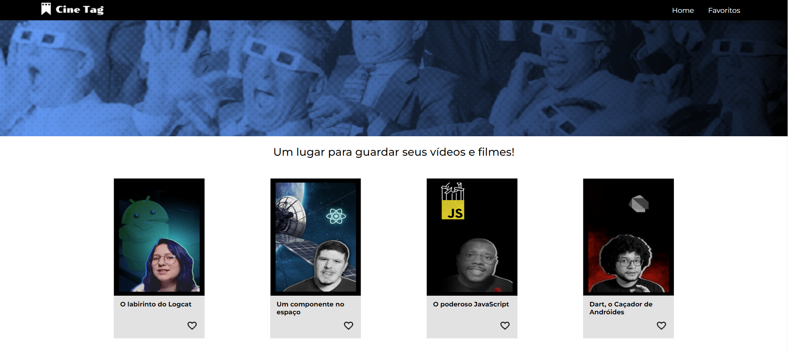

# Cinetag

O seguinte programa foi desenvolvido utilizando como base o curso **Programando em REACT** através da plataforma **Alura**. 

## Objetivo

Seu objetivo foi a criação de uma **plataforma de filmes** parecida com os sites *Filmow, letterboxd,* que tivesse as seguintes características:

* O Usuário poderá favoritar seus filmes, que serão disponibilizados na pagina *favoritos*;
* O Usuário poderá desfavoritar seus filmes, fazendo com que eles sejam retirados da pagina *favoritos*;
* O Usuário poderá transitar livremente entre as paginas;
* Ao clicar no Card do filme, o usuário será redirecionado para uma pagina onde haverá o trailer do respectivo filme;

## Conceitos Utilizados

Para a criação deste projeto, foram utilizados:

* Conhecimentos de `REACT`: 
  * *UseState* 
  * *UseEffect* 
  * *UseContext* 
  * *BrowserRouter*
* Criação e utilização de componentes dinâmicos e estáticos;
* Conhecimentos de criação de pagina utilizando `HTML` e `CSS`;
* Lógica de programação dentro do `JS`;
* Paginas totalmente responsivas para uso em telas menores;
* Criação de conteúdo dinâmico;

## Imagem Demonstrativa

